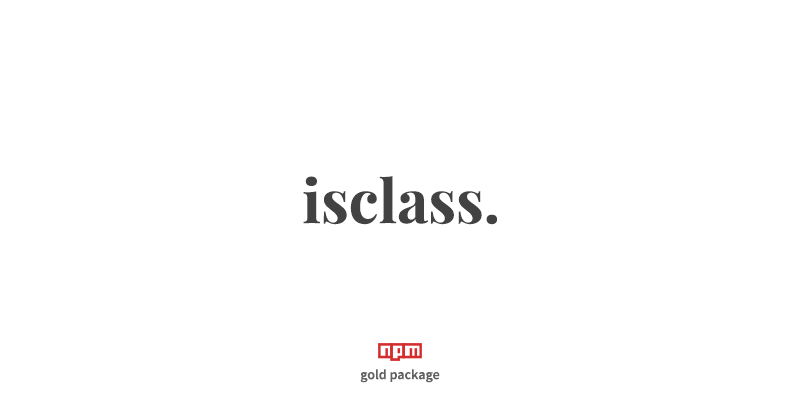

<p align="center">
    <a href="#install" alt="isClass">
        
    </a>
</p>

<p align="center">
    <strong>isclass</strong>
    <strong>&emsp;&bull;&emsp;</strong>
    <a href="https://github.com/nof1000/isarrow">isarrow</a>
    <strong>&emsp;&bull;&emsp;</strong>
    <a href="https://github.com/nof1000/isasync">isasync</a>
</p>


## What it's for?
This is Node.js library that checks whether a value is class


## Install
npm:
```
$ npm install isclass --save
```

yarn:
```
$ yarn add isclass
```


## Example
```js
const isClass = require('isclass');

console.log(isClass("hello world")); // > false
console.log(isClass(function() {})); // > false
console.log(isClass(async function() {})); // > false
console.log(isClass(class {})); // > true
console.log(isClass(() => {})); // > false
console.log(isClass(async () => {})); // > false
console.log(isClass(123)); // > false
console.log(isClass({})); // > false
console.log(isClass([])); // > false
```


## LICENSE
[MIT](./LICENSE "The MIT License")
